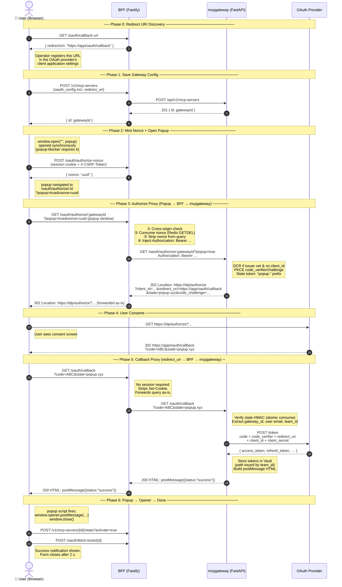

# MCP OAuth Authorization Code Flow — End-to-End

This document traces the full OAuth 2.0 Authorization Code flow from the UI
form through the BFF (Fastify), the MCP Gateway (mcpgateway/ContextForge),
the OAuth provider, and back. Special attention is paid to the `redirect_uri`
— what it is, why it matters, and where it sits in this architecture.

---

## Table of Contents

1. [UI Form — Configuration + Redirect URI Discovery](#1-ui-form--configuration--redirect-uri-discovery)
2. [Form Submit → Gateway Created → OAuth Popup Triggered](#2-form-submit--gateway-created--oauth-popup-triggered)
3. [BFF Routes — The Four OAuth Proxy Endpoints](#3-bff-routes--the-four-oauth-proxy-endpoints)
4. [mcpgateway — The Two OAuth Endpoints](#4-mcpgateway--the-two-oauth-endpoints)
5. [Journey Back — PostMessage → Form Resolution](#5-journey-back--postmessage--form-resolution)
6. [Full Flow Diagram](#6-full-flow-diagram)
7. [The Redirect URI — Summary](#7-the-redirect-uri--summary)

---

## 1. UI Form — Configuration + Redirect URI Discovery

**Key files:**

- `src/components/mcp-servers/OAuth2Auth.tsx`
- `src/hooks/useMCPServerForm.ts`

The user opens the MCP Server form, picks `authorization_code` as the grant
type, and fills in:

- **Authorization URL** — the OAuth provider's `/authorize` endpoint
- **Token URL** — the provider's `/token` endpoint
- **Client ID / Secret**
- **Scopes**

### The Redirect URI Problem

A `redirect_uri` is the URL the OAuth provider redirects the browser back to
**after** the user approves the consent screen. It must be **pre-registered**
with the provider — the provider will refuse to redirect to any URL that
doesn't exactly match what's on file.

**The tricky bit in a split deployment:** the Web UI is internet-facing but
mcpgateway is only reachable internally. The OAuth provider can't redirect to
mcpgateway's own address — nothing would answer. So the `redirect_uri` must
point at the **Web UI's BFF**, not mcpgateway.

### How the UI Resolves It

The form does **not** guess the redirect URI from `window.location.origin`
(which would break behind a reverse proxy). Instead, as soon as
`authorization_code` is selected, the form fires a query to the BFF:

```
GET /oauth/callback-url
→ { redirectUri: "https://<public-origin>/oauth/callback" }
```

The BFF computes this server-side from the `PUBLIC_ORIGIN` env var or trusted
proxy headers — the same trustworthy path that origin validation uses. The
result is displayed **read-only** with a copy button so the operator can
register it with their OAuth provider.

The form also **blocks submission** while the redirect URI is unresolved (still
loading or errored), preventing a silent fall-back to mcpgateway's own
APP_DOMAIN default which only works when mcpgateway is independently
internet-reachable.

---

## 2. Form Submit → Gateway Created → OAuth Popup Triggered

**Key files:**

- `src/hooks/useMCPServerForm.ts`
- `src/api/servers.ts`

On submit the form:

1. Calls `POST /v1/mcp-servers` to create the gateway, persisting the full
   OAuth config (including `redirect_uri`) in mcpgateway's DB.
2. Immediately calls `serversApi.triggerOAuthAuthorization(gatewayId)` to
   start the interactive authorization flow.

### Inside `triggerOAuthAuthorization`

This function handles a subtle browser constraint: popup blockers only allow
`window.open()` from within the **synchronous call stack of a user gesture**.
Fetching a nonce first would lose that privilege. So the order is:

1. **Open a blank popup synchronously** — before any async work:

   ```js
   const authWindow = window.open("", "oauth_authorization", ...);
   ```

2. **Register a `postMessage` listener** on the opener window to receive the
   callback result.

3. **Mint a one-time nonce** via an async CSRF-protected POST:

   ```
   POST /oauth/authorize-nonce → { nonce: "uuid" }
   ```

4. **Navigate the popup** to the authorize proxy route:
   ```
   authWindow.location.href = `/oauth/authorize/${id}?popup=true&nonce=${nonce}`;
   ```

#### Why the Nonce?

`window.open()` navigation is a top-level GET — browsers don't send an
`Origin` header on it. Cross-origin protection normally relies on the `Origin`
header, but its absence means a hostile sibling subdomain
(`evil.example.com`) could force a logged-in victim's browser to open the
authorize URL and trigger DCR registration / DB writes using the victim's
session cookie (SameSite=Lax rides along on top-level navigations).

The nonce closes this: it is minted only from a same-origin, CSRF-protected
POST. A sibling subdomain can't forge that POST because it can't read the CSRF
token (handed to the SPA only in the JSON body of `/auth/login` /
`/auth/session`, readable by same-origin script alone). The authorize route
consumes the nonce atomically (Redis GETDEL), so replays are impossible.

---

## 3. BFF Routes — The Four OAuth Proxy Endpoints

The BFF (Fastify, `server/`) sits between the browser and mcpgateway. It owns
four OAuth-related routes.

### `GET /oauth/callback-url`

**File:** `server/src/routes/proxy/oauth-callback-url.ts`

Returns the deployment's own redirect URI:

```json
{ "redirectUri": "https://<public-origin>/oauth/callback" }
```

Requires a valid session (`sessionAuth`). Uses `resolvePublicOrigin()` from
`server/src/lib/origin-guard.ts` which reads `config.publicOrigin` (set by
`PUBLIC_ORIGIN` env var) rather than `request.host`, so it works correctly
behind a reverse proxy.

**This is the URL you register with your OAuth provider.**

---

### `POST /oauth/authorize-nonce`

**File:** `server/src/routes/proxy/oauth-authorize-nonce.ts`

Protected by `sessionAuth + csrfProtection`. Generates a `randomUUID`, stores
`nonce → sessionId` in Redis with a short TTL, and returns `{ nonce }`.

The nonce is the CSRF substitute for the popup navigation that follows.

---

### `GET /oauth/authorize/:gatewayId`

**File:** `server/src/routes/proxy/oauth-authorize.ts`

This is where the popup lands after being navigated. The route:

1. Rejects cross-origin requests (`isForbiddenCrossOrigin`).
2. **Atomically consumes the nonce** from Redis (GETDEL) and validates it
   belongs to this session — single-use, no replay possible.
3. Strips the now-consumed nonce from the query before forwarding.
4. **Injects the session's bearer token** into the upstream request
   (`Authorization: Bearer <token>`). This is why this hop is proxied: a
   raw `window.open()` navigation can't carry an Authorization header, but
   mcpgateway's `/oauth/authorize` requires authentication (it may run DCR
   registration and DB writes).
5. Forwards to mcpgateway: `GET <CONTEXTFORGE_URL>/oauth/authorize/<gatewayId>`.
6. Uses `redirect: "manual"` so mcpgateway's `302` to the OAuth provider is
   forwarded to the browser as-is rather than followed server-side.

The browser then follows the `302` to the real OAuth provider's consent screen.

---

### `GET /oauth/callback`

**File:** `server/src/routes/proxy/oauth-callback.ts`

After the user approves on the OAuth provider, the provider redirects the
browser to the **registered `redirect_uri`** — which is
`<BFF-origin>/oauth/callback?code=...&state=...`.

This route:

1. **Requires no session** — security comes from mcpgateway's HMAC-signed
   `state` parameter, not a cookie.
2. Strips `Set-Cookie` headers from mcpgateway's response — mcpgateway's own
   cookies must never leak through to the browser under the BFF's session
   boundary.
3. Forwards the full query string to mcpgateway server-to-server:
   `GET <CONTEXTFORGE_URL>/oauth/callback?code=...&state=...`

This second proxy hop is exactly why the split-deployment works: the provider
redirects to the BFF's **public address**, and the BFF forwards the
authorization code to mcpgateway over the **internal `CONTEXTFORGE_URL`**,
which is reachable by definition.

---

## 4. mcpgateway — The Two OAuth Endpoints

**File:** `mcpgateway/routers/oauth_router.py`

### `GET /oauth/authorize/{gateway_id}` — `initiate_oauth_flow`

Receives the bearer-token-authenticated request forwarded by the BFF. It:

1. Loads the gateway's `oauth_config` from the DB.
2. **DCR (Dynamic Client Registration):** if there is an `issuer` but no
   `client_id`, and `MCPGATEWAY_DCR_ENABLED=true`, mcpgateway automatically
   registers a new OAuth client with the Authorization Server (RFC 7591),
   persisting the obtained `client_id` and encrypted `client_secret`.
3. Falls back to `_default_redirect_uri(request)` if no `redirect_uri` is
   stored — mcpgateway's own `/oauth/callback`. (The BFF's pre-population
   of the field means this fallback is rarely exercised in practice.)
4. Calls `OAuthManager.initiate_authorization_code_flow()` which:
   - Generates a PKCE `code_verifier` / `code_challenge` pair.
   - Creates an HMAC-signed `state` token, prefixed with `popup.` because
     `?popup=true` was sent.
   - Stores the state (keyed by the HMAC) with `app_user_email` and
     `team_id` for retrieval at callback time.
5. Returns `302 → <provider>/authorize?client_id=...&redirect_uri=<BFF>/oauth/callback&state=popup.xyz&code_challenge=...`.

The browser follows this to the real OAuth provider's consent screen.

---

### `GET /oauth/callback` — `oauth_callback`

After the user approves, the provider redirects to `redirect_uri` —
`<BFF>/oauth/callback?code=...&state=popup.xyz...`. The BFF proxies it here.

mcpgateway:

1. Detects `state.startsWith("popup.")` → sets `is_popup = True`.
2. Resolves `gateway_id` from the HMAC-verified `state` (without consuming it
   yet — only for the DB lookup).
3. Calls `OAuthManager.complete_authorization_code_flow()` which:
   - **Atomically consumes and verifies the `state`** (eliminates TOCTOU race).
   - Sends `POST <token_url>` with `code`, `code_verifier`, `redirect_uri`,
     `client_id`, `client_secret` to the provider.
   - Returns the token response plus the state payload.
4. Extracts `app_user_email` and `team_id` from the (now-consumed) state.
5. Stores the access/refresh tokens via `TokenStorageService`
   (Vault path keyed by team).
6. Because `is_popup = True`, returns **HTML that posts the result back to
   the opener** instead of a full page:

```html
<script nonce="...">
  (function () {
    if (window.opener && !window.opener.closed) {
      window.opener.postMessage(
        { type: "oauth_callback", status: "success", gatewayId: "...", gatewayName: "..." },
        "*",
      );
      window.close();
    }
  })();
</script>
```

> `targetOrigin` is `"*"` rather than `window.location.origin` because in
> production the API server and the React app may run on different origins.
> The receiver mitigates this by validating `event.source === authWindow` —
> only the window that initiated the flow can act on the result.

---

## 5. Journey Back — PostMessage → Form Resolution

The BFF forwards the HTML to the popup browser window. The inline script fires,
sending `postMessage` to the opener (the main app window) and closing the popup.

Back in `src/api/servers.ts`, the `messageHandler` on the opener window receives it:

```ts
const messageHandler = (event: MessageEvent) => {
  if (event.source !== authWindow) return; // must be our exact popup
  if (data.status === "success") resolve(data);
  else reject(new Error(data.errorDescription ?? data.error ?? "OAuth authorization failed"));
};
```

`triggerOAuthAuthorization` resolves. The form hook then:

1. Calls `POST /v1/mcp-servers/{id}/state?activate=true` to enable the gateway.
2. Calls `POST /oauth/fetch-tools/{id}` to pull tools/resources/prompts from
   the now-authorized MCP server.
3. Shows a success notification and closes the form after 2 seconds.

If the popup is closed by the user before completing, a 1-second polling
interval detects `authWindow.closed` and rejects the promise with
`"OAuth authorization was cancelled"`.

---

## 6. Full Flow Diagram

> Rendered natively on GitHub, GitLab, Notion, Obsidian, and VS Code
> (Markdown Preview Mermaid Support extension).



---

## 7. The Redirect URI — Summary

| Question                                  | Answer                                                                                                                                         |
| ----------------------------------------- | ---------------------------------------------------------------------------------------------------------------------------------------------- |
| **What is it?**                           | The URL the OAuth provider redirects the browser to after consent, carrying `?code=...&state=...`                                              |
| **Who owns it?**                          | The BFF — `<publicOrigin>/oauth/callback` — so it is publicly reachable                                                                        |
| **Why not mcpgateway's own URL?**         | In a split deployment mcpgateway isn't public; the provider would redirect to an unreachable address                                           |
| **Where is it registered?**               | In the OAuth provider's client application settings — manually, by the operator, before the first use                                          |
| **Where is it stored?**                   | In the gateway's `oauth_config.redirect_uri` in mcpgateway's DB; sent in both the `/authorize` redirect and the `/token` exchange              |
| **How does the UI know it?**              | `GET /oauth/callback-url` — the BFF computes it server-side from `PUBLIC_ORIGIN` or trusted proxy headers, never from `window.location.origin` |
| **How does mcpgateway receive the code?** | The BFF's `/oauth/callback` proxies the provider's browser redirect to mcpgateway server-to-server over the internal `CONTEXTFORGE_URL`        |
| **What happens if it's missing?**         | mcpgateway falls back to its own `APP_DOMAIN/oauth/callback` — only works when mcpgateway itself is publicly reachable                         |

---

## Relevant Source Files

| File                                               | Role                                                                 |
| -------------------------------------------------- | -------------------------------------------------------------------- |
| `src/components/mcp-servers/OAuth2Auth.tsx`        | UI form — redirect URI display, all OAuth fields                     |
| `src/hooks/useMCPServerForm.ts`                    | Form state, redirect URI fetch, submit/OAuth flow orchestration      |
| `src/api/servers.ts`                               | `triggerOAuthAuthorization` — popup, nonce, postMessage listener     |
| `server/src/routes/proxy/oauth-callback-url.ts`    | BFF: returns the deployment's own redirect URI                       |
| `server/src/routes/proxy/oauth-authorize-nonce.ts` | BFF: mints one-time CSRF-substitute nonce                            |
| `server/src/routes/proxy/oauth-authorize.ts`       | BFF: proxies authorize, injects bearer token, validates nonce        |
| `server/src/routes/proxy/oauth-callback.ts`        | BFF: proxies callback, forwards code to mcpgateway                   |
| `server/src/lib/oauth-authorize-nonce.ts`          | Nonce mint/consume (Redis GETDEL)                                    |
| `server/src/lib/oauth-upstream-forward.ts`         | Shared GET-and-forward for both OAuth proxy hops                     |
| `server/src/lib/origin-guard.ts`                   | `resolvePublicOrigin`, `isForbiddenCrossOrigin`                      |
| `mcpgateway/routers/oauth_router.py`               | mcpgateway: `initiate_oauth_flow`, `oauth_callback`, DCR, popup HTML |
